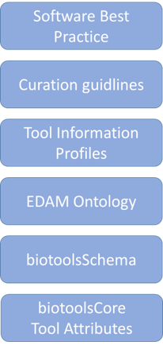

# Tool Information Standards

This is the repo for the website of the **Tool Information Standards**; a stack of community-defined, open and integrated technologies, technical standards and guidelines:

 

Please visit the [website](https://bio-tools.github.io/Tool-Information-Standards/) to learn more.

# Files
File | Description
---- | -----------
docs | [Website](https://bio-tools.github.io/Tool-Information-Standards/) built using [GitHub pages](https://pages.github.com/).

