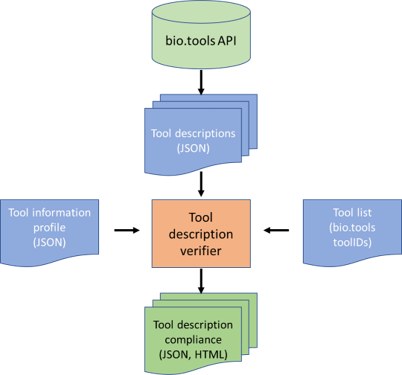

# Tool Information Profiles

A *tool information profile* is a JSON document which specifies which tool attributes - defined in [biotoolsSchema](https://github.com/bio-tools/biotoolsSchema) - should be specified within a set of tool descriptions.

biotoolsSchema [attributes](https://biotoolsschema.readthedocs.io/en/latest/biotoolsschema_elements.html#) may be specified within a profile as:
* **Mandatory** - the attribute **MUST** be defined
* **Recommended** - the attribute **SHOULD** be defined
* **Optional** - the attribute **MAY** be defined
* **Not applicable** - the attribute is not relevant to this tool set and **MUST NOT** be defined.

The key words "MUST", "MUST NOT", "SHOULD", and "MAY", and "OPTIONAL" are to be interpreted as described in [RFC 2119](http://www.ietf.org/rfc/rfc2119.txt):

* "MUST" means that the guideline is an absolute requirement of the specification.
* "MUST NOT" mean that the guideline is an absolute prohibition of the specification.
* "SHOULD" mean that there may exist valid reasons in particular circumstances to ignore a particular guideline, but the full implications must be understood and carefully weighed before doing so.
* "MAY mean that the guideline is truly optional; you can choose to follow it or not.

Tool information profiles **MUST** comply with the Tool Information Profile Schema (a JSON schema). This schema supports most of the biotoolsSchema attributes.  It does not make sense to include some of the attributes, and these are excluded. 

It is anticipated the tool information profiles will be used by a tool description verification service, which will take as input 1) a list of bio.tools tool IDs and 2) a tool information profile, and produce as output a report on the compliance of the tool descriptions to the standard, in human and machine-readable formats. Tool descriptions would be consumed in JSON format, *e.g.* by invoking the [bio.tools](https://bio.tools) API.

# Files

File | Description
---- | -----------
toolInfoProfileSchema | Tool Information Profile Schema (JSON Schema)
sampleToolInfoProfile | Sample tool information profile (JSON file)

